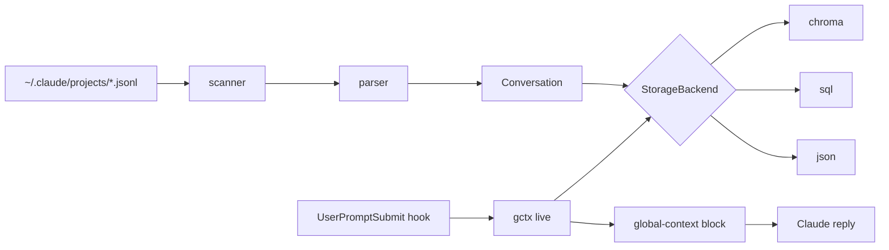

# global-context

> Persistent context store for [Claude Code](https://claude.ai/code) — indexes every past session, project fact, and note for semantic recall via CLI, skill, and hooks.

[](https://pypi.org/project/global-context/)
[](https://pypi.org/project/global-context/)
[](LICENSE)
[](https://github.com/FernandoCelmer/global-context/actions)
[](https://github.com/FernandoCelmer/global-context)

---

## Why

Claude Code forgets between sessions. `global-context` ingests every `~/.claude/projects/**/*.jsonl` log, plus your own notes, into a local store (SQLite, JSON, or ChromaDB vector index) and feeds the relevant slice back into every new prompt via a `UserPromptSubmit` hook. Zero config.

## Features

- Auto-ingest all past Claude Code sessions (transcripts, tool calls, results)
- Semantic search with ChromaDB embeddings (or fast SQL token match)
- Hooks: `SessionStart` and `UserPromptSubmit` inject context automatically
- Skill bundled, installs to `~/.claude/skills/global-context/SKILL.md`
- Pluggable backends: JSON, SQLAlchemy 2.x, Chroma — single ABC
- Zero config: `pip install` then go; `.pth` bootstraps storage on first import

## Install

```bash
pip install global-context
```

Storage and skill self-install on first Python startup. No flags, no init.

## Quick start

```bash
gctx sessions sync                # ingest every Claude Code session log
gctx live "kafka"                 # recall past context (semantic)
gctx save --title T --content C   # save a note
gctx hook install --apply         # auto-recall on every prompt
gctx sessions active              # see live sessions on this machine
gctx sessions tail --follow       # stream messages from current session
```

## Backends

Pick via `GCTX_BACKEND=sql|json|chroma` or `--backend`.

| Backend | Search          | Deps        | Default |
|---------|-----------------|-------------|---------|
| chroma  | semantic vector | chromadb    | yes     |
| sql     | tokenized LIKE  | SQLAlchemy  |         |
| json    | substring       | none        |         |

Storage path: `GCTX_HOME` (default `~/Library/Application Support/global-context` on macOS, XDG on Linux).

## Library

```python
from global_context import get_backend, MemoryEntry

backend = get_backend("chroma")
backend.save_entry(MemoryEntry(title="auth flow", content="OAuth PKCE", project="api"))
for hit in backend.search("oauth"):
    print(hit.score, hit.entry.title)
```

## How it works



## CLI reference

```
gctx init                     bootstrap storage
gctx status                   backend, paths, counts
gctx save -t T -c C [-p P]    save memory entry
gctx list [-k K] [-p P]       list entries
gctx show <id>                show entry as JSON
gctx search <q> [-k K] [-p P] tokenized / vector search
gctx delete <id>              remove entry
gctx live <q>                 recall block for hooks
gctx boot                     emit project context (SessionStart)
gctx sessions list            discover Claude session files
gctx sessions sync [-f]       ingest all sessions
gctx sessions search <q>      search inside session content
gctx sessions active          live sessions on this machine
gctx sessions tail [id] [-f]  tail / follow a session log
gctx convo save|list|show     conversation transcripts
gctx skill install            (re)install bundled SKILL.md
gctx hook install [--apply]   merge hooks into ~/.claude/settings.json
gctx hook uninstall           remove hook entries
```

## License

MIT, Fernando Celmer
